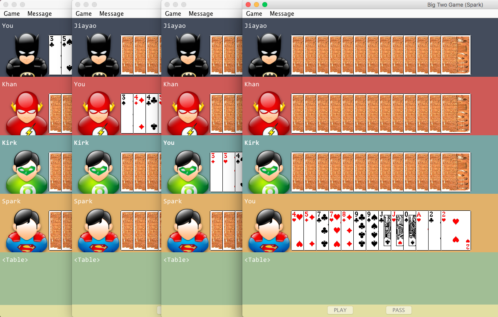
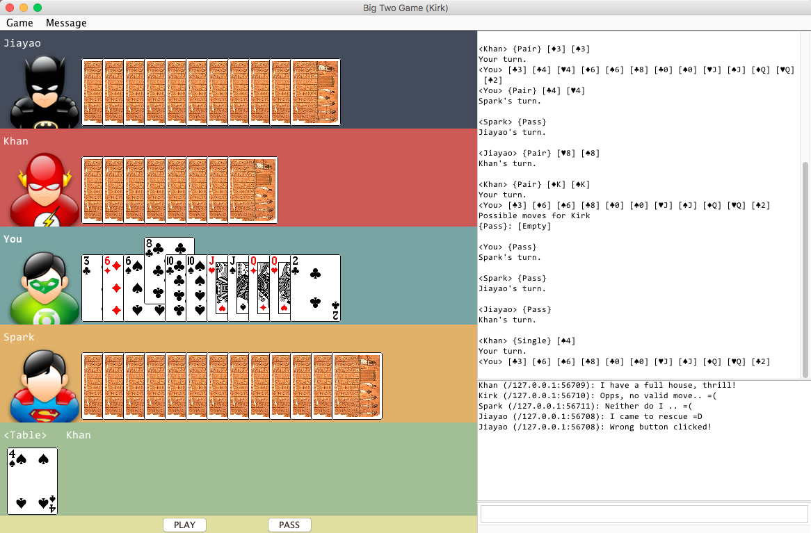
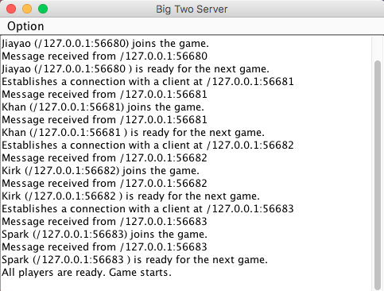
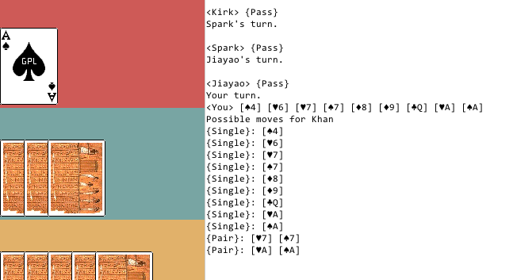
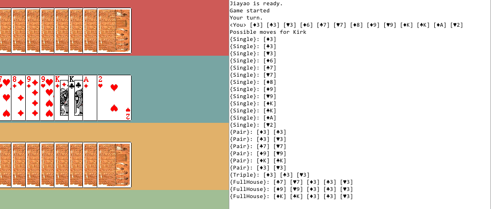
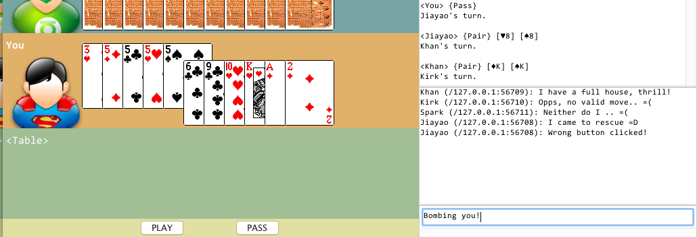
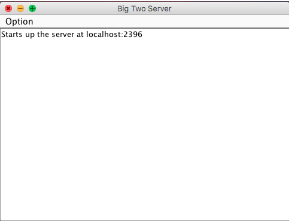
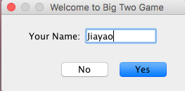
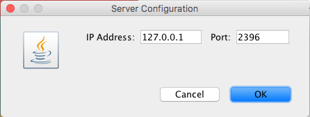
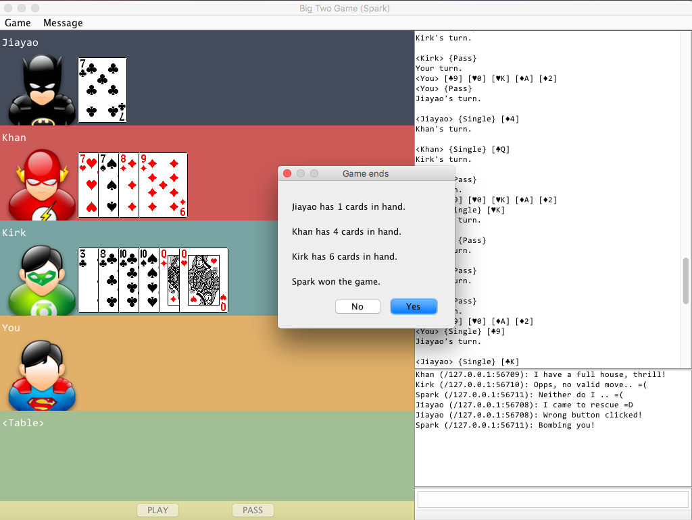

# Big Two Game with `Java`

## Introduction and Features

The "Big Two" game is a popular card game of four players.
"Big Two Game with `Java`", as the name suggested, is powered by `Java`.

This game supports the following features:

- Pleasant UI/UX

- Multi-player via Socket I/O (both localhost/LAN/WAN)

- Shortcut Keys

Multiple shortcuts are supported for better
enjoying the game:

| Key | Function |
|:------------------:|:----:|
| `<SHIFT> + <RETURN>` | Play |
|       `<SPACE>`      | Pass |
|  `<CTRL> + <RETURN>` | Hint |
|      `<RETURN>`      | Chat |

- Game Hints

Got stuck of what can be player? No problem,
a hinter comes to rescue:

- Asynchronous Chatting

Chat with your friends while gaming!

## Installation

Before proceed, you should make sure you have a working `Java` distribution
of version greater than `JSE-6`. To obtain a latest copy, one may
visit the [Oracle's JSE page](http://www.oracle.com/technetwork/java/javase/overview/index.html).

First, clone this repo using `git`:

    git clone https://github.com/zjiayao/BigTwoGame

Then one may compile from source:

    cd BigTwoGame/src && javac BigTwoClient.java && javac BigTwoServer.java

That's all!

## Usage

Big-Two Game supports multi-player, and can be invoked in a LAN environment. In
this section, we run the server and clients on `localhost` for illustration.

First compile the source (see previous section) and navigate
to the `src` folder:

    cd src

then invoke the `server`:

    ./java BigTwoServer &

On a Windows machine, the command is analogous:

    run java ./BigTwoServer

This command spawns a dedicated server window,
by default, listens to the socket at `localhost`
with port being `2397`.

Noted each game requires four players, hence
we run four clients:

    ./java BigTwoClient &
    ...

First specify your name and join the server:

After game ends, the result is prompted:

After all players view the result, a new game is about
to being.

## Development

You are welcome to submit a PR, be sure to check
the thorough [documentation](doc/index.html) of the implementation.

### Software Structure

Essentially, the game is modeled by a handful of
classes and interfaces, concretely:

A [much more detailed class diagram](doc/doc-files/Class%20Diagram.svg) can also be found
in teh `doc/doc-files` subfolder, which listed
all major APIs.

As such, the core use cases are summarized below:

### UI/UX Design

The core philosophy for the design is simplicity,
which infact turns out pretty well. The GUI is powered
by `java.swing`, mostly `JPanel` and its subclasses.

An overview of the components is outlined below:

## Disclaimer

This project has been submitted in partial fulfillment
for the course *OOP and Java* offered by HKU, 2016-17.

